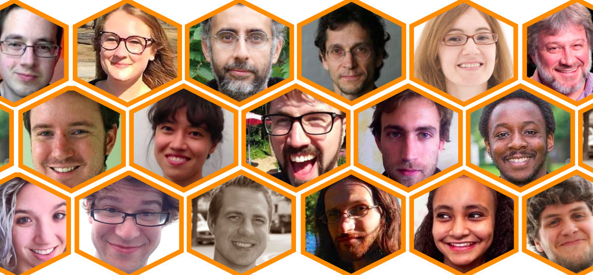
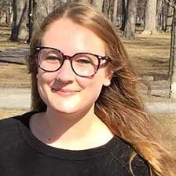
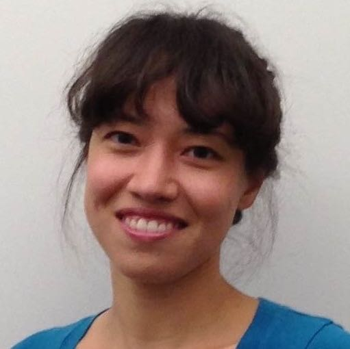
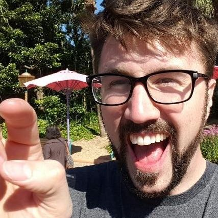
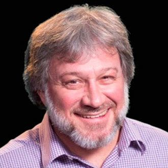
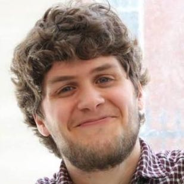
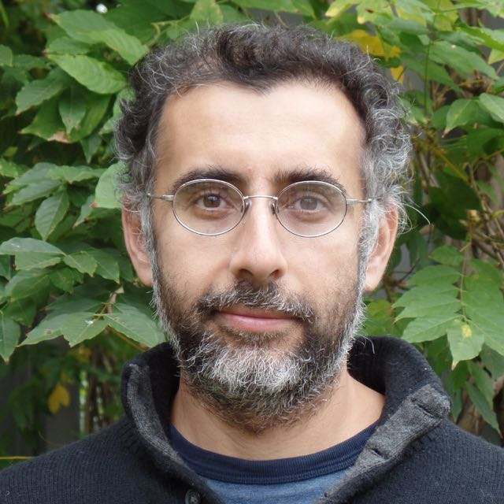
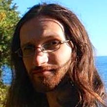

# Program

JupyterDays Boston is a 2 day event on March 17-18.

## Thursday, March 17

* 9:00AM to 9:30AM:     Registration and Breakfast
* 9:30AM to 9:40AM:     Welcome from the Organizers - Andrew Odewahn (O'Reilly Media), Chris Erdmann (Harvard-Smithsonian Center for Astrophysics), Ana Ruvalcaba (Project Jupyter)
* 9:40AM to 10:30AM:    Keynote - Matthias Bussonnier — [From Data Gathering to Publishing](JupyterDaysKeynote-Matthias-Bussonnier.pdf)
* 10:30AM to 11:00AM:   Thorin Tabor — [GenePattern Notebooks: Jupyter for Bioinformatic Research](presentations/genepattern-tabor.pdf)
* 11:00AM to 12:00PM:   [Birds of a Feather Discussions](https://jupyter.hackpad.com/JupyterDays-Boston)
* 12:00PM to 1:00PM:    Lunch
* 1:00PM to 1:30PM:     Faras Sadek, Yasha Iravantchi, Diana Zhang and Demba Ba — [Wearable Signal Processing Using Docker Notebook Containers on AWS](https://goo.gl/c7JvhZ)
* 1:30PM to 2:00PM:     Jeremy Freeman - [Binder](http://freeman-lab.github.io/talk-jupyter-march-2016/)
* 2:00PM to 2:30PM:     Safia Abdalla - [Kooking with Kernels](https://docs.google.com/presentation/d/1ukBEbdWJbddwXS5lgOgHwrJq_cmG3JYjKZDxnCh-JJE/pub?start=false&loop=false&delayms=60000&slide=id.g11c27a08dc_0_0)
* 2:30PM to 2:45PM:     Break
* 2:45PM to 3:15PM:     Elaine Angelino and Sam Lau - [Jupyter in UC Berkeley's Data Science Education Program](presentations/berkeley-data-science.pdf)
* 3:15PM to 3:45PM:     Chelsea Douglas - [Data Visualization with Plotly in Jupyter](https://nbviewer.jupyter.org/gist/cldougl/493c7872bce68c695098)
* 3:45PM to 4:00PM:     Break
* 4:00PM to 5:30PM:     Jupyter in Education Panel — Paco Nathan, Rahul Dave, Elaine Angelino, Demba Ba, Eni Mustafaraj, Allen Downey

## Friday, March 18

* 9:00AM to 9:30AM:    Registration and Breakfast
* 9:30AM to 10:45	     Jonas Rosland -- [Introduction to Docker](container.training)
* 10:45AM to 12:30PM	 Kyle Kelley and Ash Wilson -- Running JupyterHub on Docker
* 12:30PM to 1:30PM	   Lunch
* 1:30PM	to 2:30PM	   Laurent Gautier -  [Polyglot Data Analysis (Visually Demonstrated) With Python and R]( http://lgautier.github.io/jpd-pdapr-slides/)
* 2:30PM to	3:30PM	   Brian Keegan -- Data Mining and Network Analysis from Wikipedia Data
* 3:30PM to 4:30PM	   Peter Bull -- Data Science is Software
* 4:30PM to 5:00PM	   Closing Remarks

# Code of Conduct

Project Jupyter is an engaged and respectful community made up of people from all over the world. Your involvement helps us to further our mission and create an open platform that serves a broad range of communities, from research and education to journalism, industry and beyond.

At Project Jupyter and JupyterDay, we are committed to providing a harassment-free conference experience for everyone, regardless of gender, sexual orientation, disability, physical appearance, body size, race, or religion. Conference organizers will not tolerate harassment of participants in any form. Sexual language and imagery is not appropriate for any part of the conference venue, including talks.

For the full code of conduct and how to report an incident, see [code of conduct](code_of_conduct.md).

# Key Information

The event is being held at:

Harvard Law School

[Wasserstein Hall](https://goo.gl/maps/K1ziSzLsmY32)

1585 Massachusetts Ave

Cambridge, MA 02138

## Room

Milstein East A & B

## Social Media

We will be using the hash tag `#JupyterDays` for the event. Please tweet liberally during the event!

# Speakers

# Allen Downey
## Olin College

Allen Downey is a Professor at [Olin College](http://www.olin.edu/) and the author of a series of books including _Think Python_, _Think Bayes_, and _Think Stats_, all published by [O’Reilly Media](http://www.oreilly.com/) and available under free licenses from [Green Tea Press](http://greenteapress.com/).

# Ash Wilson
## Rackspace

Ash Wilson builds developer tools, SDKs, and a content management system on the Developer Experience team at Rackspace. His interests include programming languages, IDEs, chat bots, continuous integration and delivery, configuration management, and Docker.

# Brian Keegan
## Harvard Business School / Institute for Quantitative Social Science

Brian is a scientist of network, data, and social computing and a research associate at the Harvard Business School’s HBX online learning platform. His research analyzes the structure and dynamics of large-scale online collaboration and communication networks. He received his Ph.D. in Media, Technology, & Society from Northwestern University and S.B. degrees in Mechanical Engineering and Science, Technology, & Society from MIT.

# Chelsea Douglas
## Plotly

Chelsea Douglas is the lead support engineer at Plotly. She is developing Plotly's python API and javascript library, and is also an avid Jupyter Notebook user!

# Daina Bouquin
## Harvard-Smithsonian Center for Astrophysics

Daina Boiquin is the Assistant Head Librarian at the [Harvard-Smithsonian Center for Astrophysics](https://www.cfa.harvard.edu/) in Cambridge, MA. Her work focuses primarily on how computational techniques and thinking can be applied to socio-technical and historical questions about how libraries and archives can contribute to the creation of new knowledge. Some specific topics of interest include [open data](http://en.wikipedia.org/wiki/Open_data "Open Data"), [metadata](http://en.wikipedia.org/wiki/Metadata "metadata"), [data visualization](http://en.wikipedia.org/wiki/Data_visualization "Data Visualization"), [machine learning](http://en.wikipedia.org/wiki/Machine_learning "Machine Learning") and digital technologies development.

# Demba Ba
## Harvard University

Demba Ba is Professor of Electrical Engineering and Bioengineering in the School of Engineering and Applied Sciences at Harvard University. He has close to 10 years of experience, in industry and academia, developing novel algorithms for extracting useful information from data. In his research, he develops mathematical and computational tools that leverage the inherent structure in data from artificial and natural systems. His group has developed a new, Jupyter-based  course on Signal Processing at Harvard that addresses several challenges.

# Elaine Angelino
## UC Berkeley

Elaine Angelino is a [Miller Fellow](http://millerinstitute.berkeley.edu/) at the University of California, Berkeley, where her faculty host is Michael I. Jordan.  She completed her A.B. in applied mathematics, M.A. in systems biology, and Ph.D. in computer science at Harvard.  Her recent research is at the intersection of machine learning and systems.

# Eni Mustafaraj
## Wellesley College

Eni Mustafaraj is an Assistant Professor of Computer Science at Wellesley College. She has introduced the use of Jupyter notebooks in the CS1 course at Wellesley, and they are now used extensively during class time. Jupyter notebooks are also the central component of her elective course on Data Science.

# Jeremy Freeman
## Janelia / mybinder.org

Jeremy Freeman is a neuroscientist using computation to understand the brain.  He is the group leader at [Janelia](http://janelia.org), co-organizer of [CodeNeuro](http://codeneuro.org), and the creator of the popular [binder](http://mybinder.org/) service for launching Notebooks and other Docker-based environments.

# Jonas Rosland
## EMC

Jonas Rosland is a Developer Advocate at [EMC {code}](http://emccode.github.io/), loves tech, food, wine, craft beers and geeky things. He blogs at jonasrosland.com.

# Kyle Kelley
## Rackspace / Jupyter

Kyle Kelley is a programmer, sometimes mathematician, oftentimes ops. He works for Rackspace, where he both fosters Developer Experience and works on open source to benefit communities, open source projects, and the companies that rely on and support the tooling. As part of this, he is a core contributor to [IPython](http://ipython.org) and the [Jupyter](http://jupyter.org) project.

# Laurent Gautier
## Novartis

Laurent Gautier is a Senior Investigator at Novartis Institutes for BioMedical Research.  He is a long-time user of R and original core member of the bioconductor project, the lead of the [Python-R bridge](https://pypi.python.org/pypi/rpy2) (up to 60,000 downloads/month!), and he wrote the first [Julia-R bridge](https://github.com/lgautier/Rif.jl).

# Mattias Bussonnier
## Jupyter Project / UC Berkeley

Matthias Bussonnier is a post-doctoral scholar who received his PhD in Biophysics at Institut Curie (Paris, France) after a training in fundamental Physics at ENS Cachan (France).  Matthias develops tools for modern computational research across disciplines, with an emphasis on high-level languages, literate computing, and reproducible research. Matthias has been a core developer of the IPython and Jupyter Project team since 2011 and is bringing real-time collaboration to scientific tools.

# Paco Nathan
## O'Reilly Media

Paco Nathan is the Director of the Learning Group at O'Reilly Media.  He has led several data teams in industry, evangelized many popular open source projects (Spark, Mesos, Cascading, and been teaching with Jupyter notebooks for a couple of years, and loving it!  http://liber118.com/pxn/  

# Peter Bull
## DrivenData

Peter is a co-founder at [DrivenData](http://www.drivendata.org), whose mission is to bring the power of data science to the social sector. Recently he has worked on projects in smart school budgeting, predicting trends in women’s healthcare, and improving public services by using novel data sources. He earned his master’s in Computational Science and Engineering from Harvard in 2014. Previously he worked as a software engineer at Microsoft and earned a BA in philosophy from Yale University.

# Rahul Dave
## Harvard University

Rahul Dave is a Computational Scientist at the Astrophysics Data System ([ADS](http://adsabs.harvard.edu/)) at Harvard University in Cambridge, MA. He is also Chief Wrangler at Nareau Inc, a consultancy focussed on managing large data sets, finding patterns in and computing on data, visualizing data and results of computation, and making these available over the web. He is also interested in collaborative software, especially as it pertains to personal and group information management, and its potential to create new, more democratic and responsible forms of media. In the recent past, he was a computational scientist at Harvard’s [Initiative in Innovative Computing](http://www.iic.harvard.edu/). He is a cosmologist by training, and a developer by vocation. He is an avid climber and skier, and a mountain person at heart.

# Safia Abdalla
## Jupyter Project

Safia is an energetic software engineer with an interest in data science for social good, intelligent interfaces, and great coffee. She is the founder and fearless leader of [dsfa](http://dsfa.io/), a startup aimed at providing data science services to small businesses. She is also the organizer of [PyData Chicago](http://chicago.pydata.org/), where she brings an awesome community of developers and data scientists to build amazing open source software. In her free time, she enjoys working out, contributing to open-source software, and teaching people how to be awesome with code.

# Thorin Tabor
## Broad Institute

Thorin Tabor is the developer of the [GenePattern Notebook](http://www.broadinstitute.org/cancer/software/genepattern/genepattern-notebooks) environment, which uses Jupyter Notebooks to capture, automate and share workflows used in cancer research, as well as other genomic analyses.

GenePattern Notebook is an extension that allows Jupyter to communicate with the open source [GenePattern](http://www.broadinstitute.org/cancer/software/genepattern/) environment. This environment wraps hundreds of different software tools for analyzing gene expression data, and makes these tools available in a user-friendly interface.
